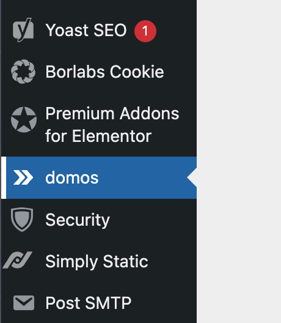
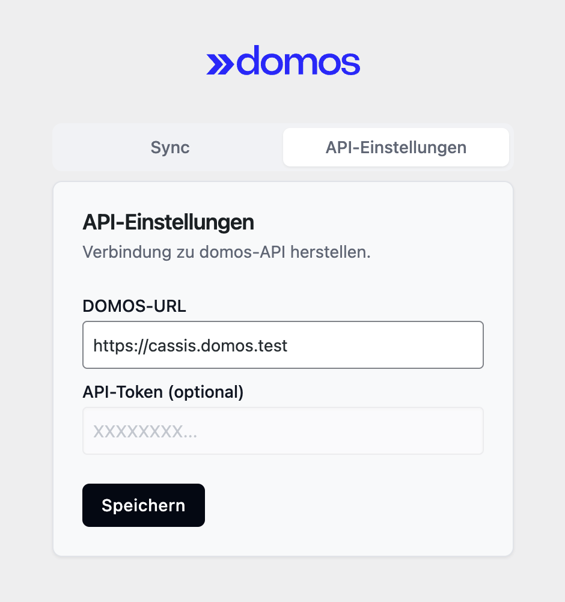
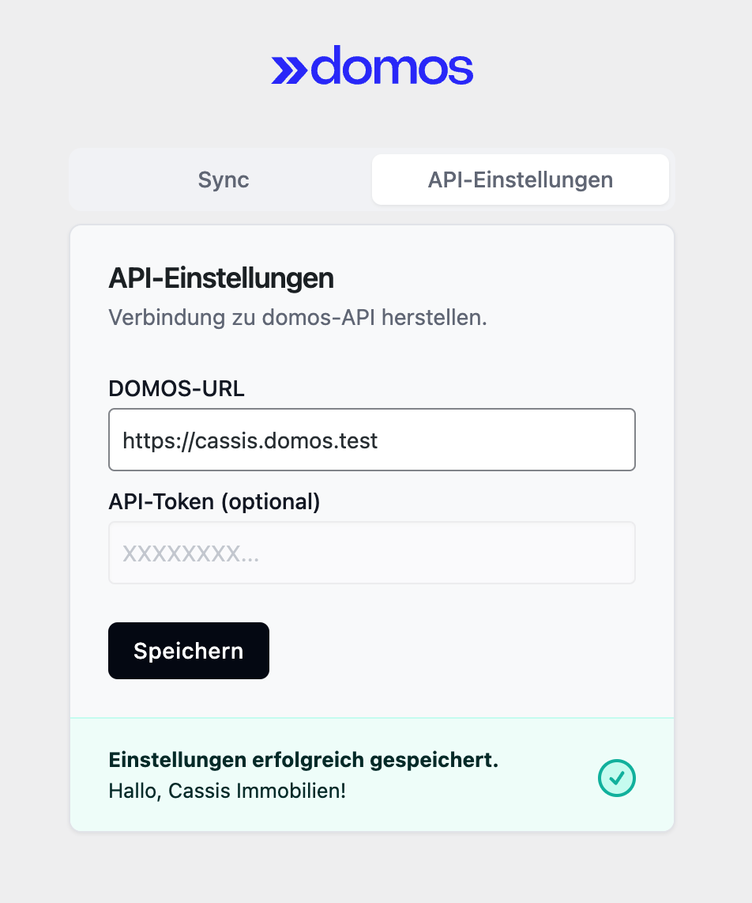
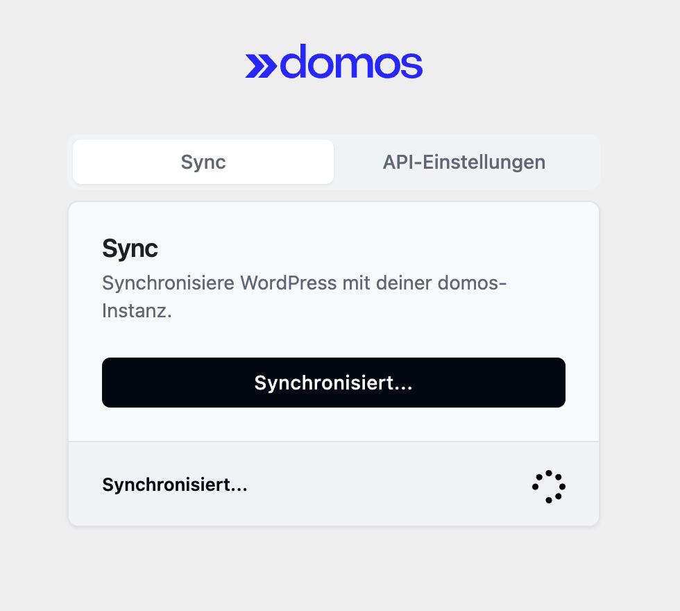
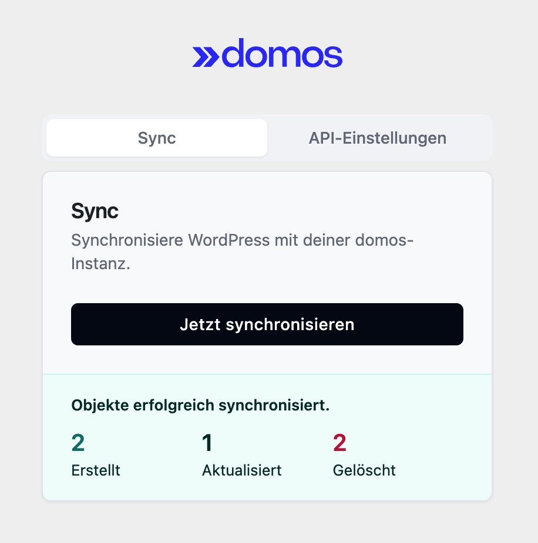

<!-- Centered image -->
<p align="center">
</p>

<div align="center">
  	
	<h1><a href="https://domos.de">domos</a> WordPress Integration</h1>
</div>

## Funktionen
- Synchronisation von Objekten
- Shortcodes für die Darstellung einer Objektliste und -suche
- Seiten für die Darstellung von Objekten
- Eingebettete Karte

---

1. [Installation](#installation)
2. [Konfiguration der Synchronisation](#konfiguration-der-synchronisation)
3. [Einbettung der Objektsuche/-karte](#einbettung-der-objektsuche-karte)
4. [Überschreiben des Theme-Layouts für Exposés](#%C3%BCberschreiben-des-theme-layouts-f%C3%BCr-expos%C3%A9s)
5. [Zugriff auf Immobiliendaten in WordPress](#zugriff-auf-immobiliendaten-in-wordpress)
6. [Weitere Konfigurationen via WordPress-Filter](#weitere-konfigurationen-via-wordpress-filter)
	- [`domos_primary_shades`](#1-domos_primary_shades)
    - [`domos_gray_shades`](#2-domos_gray_shades)
    - [`domos_is_using_dark_mode`](#3-domos_is_using_dark_mode)
    - [`domos_privacy_policy_url`](#4-domos_privacy_policy_url)
    - [`domos_default_navbar_height`](#5-domos_default_navbar_height)
    - [`domos_lottie_colors`](#6-domos_lottie_colors)
    - [`domos_font_families`](#7-domos_font_families)
    - [`domos_estate_escape_hatch`](#8-domos_estate_escape_hatch)
7. [Hinweise](#hinweise)
8. [Vollständiges Beispiel](#vollst%C3%A4ndiges-beispiel)


---

## Installation

1. Lade das Plugin in das Verzeichnis `/wp-content/plugins/` hoch
2. Aktiviere das Plugin "domos Core" im Menü 'Plugins' in WordPress
3. Konfiguriere das Plugin im Menü 'domos', indem du die URL zu deiner domos-Instanz angibst
4. Füge den Shortcode `[domos-list]` in eine Seite ein, um eine Liste der Objekte anzuzeigen
5. Syncronisiere die Objekte im Menü 'domos'
6. Fertig! Die Objekte werden nun regelmäßig synchronisiert

---

## Konfiguration der Synchronisation

Um die Objekte zu synchronisieren, musst du die URL deiner domos-Instanz angeben. Dies kannst du in den Einstellungen des Plugins machen.

| Einstellung                                                 | Wert                                                                                                                     |
|-------------------------------------------------------------|--------------------------------------------------------------------------------------------------------------------------|
|  | Die domos Einstellungen findest du im WordPress-Admin-Bereich unten im Menü 'domos'.                                     |
|       | Du kannst die URL deiner domos-Instanz hier angeben.                                                                     |
|       | Nach dem Speichern wird die Verbindung zu deiner domos-Instanz hergestellt und gespeichert.                              |
|       | Unter dem Menüpunkt "Sync" kannst du die Objekte nun synchronisieren. Dies erfolgt automatisch jeden Tag um Mitternacht. |
|       | Wenn alles geklappt hat, siehst du, was synchronisiert wurde.                                                            |

---

## Einbettung der Objektsuche/-karte

Die einfache Objektsuche/-karte kann über den 
Shortcode `[domos-list]` in eine beliebige Seite eingebettet werden.

---

## Überschreiben des Theme-Layouts für Exposés
WordPress Post Name: domos_estate
Wenn du ein Theme verwendest, dass ein eigenes Layout für Objekte oder die Standard WordPress-Post-Liste verwendest, kannst du in deinem Theme die Datei `single-domos_estate.php` oder `archive-domos_estate.php` überschreiben.

- `single-domos_estate.php` wird für einzelne Exposés verwendet.
- `archive-domos_estate.php` wird für die Standard WordPress-Post-Liste verwendet.

---

## Zugriff auf Immobiliendaten in WordPress

Die `EstatePost`-Klasse stellt eine Brücke zwischen dem Immobiliendatenschema und WordPress her und ermöglicht es Ihnen, Immobilieninformationen abzurufen und anzuzeigen, die als WordPress-Beiträge gespeichert sind. Dieser Abschnitt erklärt, wie Sie die `EstatePost`-Klasse verwenden, um auf Immobiliendaten in einer WordPress-Umgebung zuzugreifen, wobei der Schwerpunkt auf Aufgaben liegt, die für die Erstellung von Websites relevant sind.

### Zugriff auf Immobiliendaten via Immocore-ID

Um eine Immobilie anhand ihrer externen ID abzurufen:

```php
$externalId = 'immocore-ID'; // Ihre externe ID
$estatePost = \Domos\Core\EstatePost::find($externalId);

if ($estatePost !== null) {
    $estate = $estatePost->data; // Dies ist eine Instanz von SchemaImmo\Estate
    echo "Immobilienname: " . $estate->name;
    echo "Immobilienadresse: " . $estate->address->street . " " . $estate->address->number;
} else {
    echo "Immobilie nicht gefunden";
}
```

### Zugriff auf Immobiliendaten via WordPress-Post

Wenn mit Immobiliendaten in WordPress-Templates gearbeitet werden soll, kann die Methode `EstatePost::fromPost()` verwendet werden, um die Immobiliendaten aus einem `$post` zu erhalten:

```php
global $post;

if ($post->post_type === \Domos\Core\EstatePost::POST_TYPE) {
    $estatePost = \Domos\Core\EstatePost::fromPost($post);
    $estate = $estatePost->data;

    // Jetzt können Sie auf alle Immobiliendaten zugreifen
    echo "<h1>{$estate->name}</h1>";
    echo "<p>Adresse: {$estate->address->street} {$estate->address->number}, {$estate->address->city}</p>";

    if ($estate->media->thumbnail) {
        echo "media->thumbnail->src}' alt='{$estate->media->thumbnail->alt}'>";
    }

    // Merkmale anzeigen
    if (!empty($estate->features)) {
        echo "<h2>Merkmale:</h2><ul>";
        foreach ($estate->features as $feature => $value) {
            echo "<li>{$feature}: {$value}</li>";
        }
        echo "</ul>";
    }

    // Mietflächen anzeigen
    if (!empty($estate->buildings)) {
        foreach ($estate->buildings as $building) {
            echo "<h2>Gebäude: {$building->name}</h2>";
            foreach ($building->rentables as $rentable) {
                echo "<h3>Mietfläche: {$rentable->name}</h3>";
                echo "<p>Fläche: {$rentable->area} qm</p>"; // "sqm" zu "qm" lokalisiert
                echo "<p>Preis: {$rentable->price->base->amount} {$rentable->price->base->currency->value}</p>";
            }
        }
    }
}
```

Dieses Beispiel zeigt, wie auf verschiedene Aspekte der Immobiliendaten in einem WordPress-Template zugegriffen werden kann.

### Mehrere Immobilien finden

Um mehrere Immobilien abzurufen, kann die WordPress-Klasse `WP_Query` in Kombination mit `EstatePost::fromPost()` verwendet werden:

```php
$args = array(
    'post_type' => \Domos\Core\EstatePost::POST_TYPE,
    'posts_per_page' => 10,
    // ...
);

$query = new WP_Query($args);

if ($query->have_posts()) {
    while ($query->have_posts()) {
        $query->the_post();
        $estatePost = \Domos\Core\EstatePost::fromPost($query->post);
        $estate = $estatePost->data;

        // Immobilieninformationen anzeigen
        echo "<h2>{$estate->name}</h2>";
        echo "<p>{$estate->address->city}, {$estate->address->country}</p>";
    }
    wp_reset_postdata();
} else {
    echo "Keine Immobilien gefunden";
}
```

Dieses Beispiel zeigt, wie man mehrere Immobilien abfragt und grundlegende Informationen für jede anzeigt.

### Immobilienverwaltungsoperationen (Interne Verwendung)

Die folgenden Operationen sind hauptsächlich für den internen Gebrauch und die Datenverwaltung vorgesehen:

- **Erstellen einer neuen Immobilie**: `EstatePost::create($externalId, $estateData)`
- **Aktualisieren einer bestehenden Immobilie**: `EstatePost::update($externalId, $updatedEstateData)`
- **Löschen einer Immobilie**: `EstatePost::delete($externalId)`
- **Finden nicht mehr benötigter Immobilien**: `EstatePost::findUnneeded($activeIds)`

Diese Methoden sollten mit Vorsicht und typischerweise innerhalb von administrativen Oberflächen oder Hintergrundprozessen verwendet werden, anstatt in öffentlich zugänglichem Website-Code.

Durch die Verwendung der `EstatePost`-Klasse kann das Immobiliendatenschema nahtlos in WordPress integriert werden, was den einfachen Abruf und die Anzeige komplexer Immobilieninformationen auf der WordPress-Site ermöglicht.

---

## Weitere Konfigurationen via WordPress-Filter

### 1. `domos_primary_shades`

Modifiziert die primären Farben, die im Plugin verwendet werden. Verwendet Farb-Paletten im [Tailwind-Format](https://tailwindcss.com/docs/customizing-colors#color-palette-reference).

**Standardwert:** Ein Array von Farbcodes für die Schattierungen 50 bis 950.

**Anwendung:**
```php
add_filter('domos_primary_shades', fn () => [
    '50' => '#f4f7fb',
    '100' => '#e9eff7',
    '200' => '#c7d7ec',
    '300' => '#a5bee1',
    '400' => '#628eca',
    '500' => '#1e5db3',
    '600' => '#1b54a1',
    '700' => '#174686',
    '800' => '#12386b',
    '900' => '#0f2e58',
    '950' => '#091c36',
]);
```

### 2. `domos_gray_shades`

Modifiziert die grauen Farben, die im Plugin verwendet werden. Verwendet Farb-Paletten im [Tailwind-Format](https://tailwindcss.com/docs/customizing-colors#color-palette-reference).

**Standardwert:** Ein Array von Farbcodes für die Schattierungen 50 bis 950.

**Anwendung:**
```php
add_filter('domos_gray_shades', fn () => [
    '50' => '#fafafa',
    '100' => '#f5f5f5',
    '200' => '#e5e5e5',
    '300' => '#d4d4d4',
    '400' => '#a3a3a3',
    '500' => '#737373',
    '600' => '#525252',
    '700' => '#404040',
    '800' => '#262626',
    '900' => '#171717',
    '950' => '#0a0a0a',
]);
```

### 3. `domos_is_using_dark_mode`

Bestimmt, ob das Plugin den Dunkelmodus verwenden soll.

**Standardwert:** `false`

**Anwendung:**
```php
add_filter('domos_is_using_dark_mode', fn () => true);
```

### 4. `domos_privacy_policy_url`

Legt die URL für die Datenschutzrichtlinie fest.

**Standardwert:** `'/datenschutz'`

**Anwendung:**
```php
add_filter('domos_privacy_policy_url', fn () => '/neue-datenschutzrichtlinie');
```

### 5. `domos_default_navbar_height`

Die Kopfbereiche der Exposés können "Full-Height"-Varianten verwenden, welche den Kopfbereich auf die gesamte Höhe des Bildschirms bringen.
Legt die Höhe für die Navigationsleiste fest, damit diese von der "Full-Height" abgezogen werden kann. (HTML-Einheiten wie `px`, `em` oder `rem` möglich).

**Standardwert:** `80px`

**Anwendung:**
```php
add_filter('domos_default_navbar_height', fn () => '100rem');
```

### 6. `domos_lottie_colors`

Modifiziert die Farben, die in den Merkmal-Icons verwendet werden.


**Standardwert:** Ein Array mit 'color1' (primäre Schattierung 900) und 'color2' (primäre Schattierung 500).

**Anwendung:**
```php
add_filter('domos_lottie_colors', fn () => [
    'color1' => '#0f2e58',  // Angepasstes Dunkelblau
    'color2' => '#1e5db3',  // Angepasstes Hellblau
]);
```

### 7. `domos_font_families`

Konfiguriert die Schriftarten, die innerhalb des Exposés verwendet werden sollen.
Akzeptiert ein Array von Schriftarten, die von WordPress verwendet werden.
Es werden automatisch `""` doppelte Anführungszeichen hinzugefügt, außer bei Werten wie `inherit`, `sans-serif`, etc...

> [!NOTE]
> Die Schriftarten müssen selber via normales WordPress CSS importiert werden.
> Dieser Filter legt nur fest, welche Schriftart von den Exposé-Elementen verwendet werden soll.

**Standardwert:** `['sans-serif']`

**Anwendung:**
```php
add_filter('domos_font_families', fn () => ['Roboto Slab', 'serif']);
```


### 8. `domos_estate_escape_hatch`

> [!TIP]
> Dies ist kein Filter via `add_filter()`, sondern eine "Action" via `add_action()`.

Diese Action dient dazu, eigenes CSS und JS innerhalb des Shadow DOM eines Exposés zu platzieren.
Durch die Funktionsweise des Shadow DOM, kann es schwieriger sein, Inhalte innerhalb des Shadow DOMs zu stylen und zu bearbeiten.

Diese Action wird innerhalb des Shadow DOMs ausgeführt, wodurch jeder `<style>` und `<script>` Tag innerhalb des Shadow DOMs funktioniert.

> [!WARNING]
> Wir können nicht garantieren, dass die eigenen Änderungen, die du mit dem Escape Hatch vornehmen kannst, langfristig kompatibel sind.
> Der Escape Hatch ist sehr mächtig, aber es kann sein, dass manch eigenes Styling später nachgebessert werden muss. Das ist der Trade-Off zwischen Flexibilität und Stabilität.

**Anwendung:**

```php
add_action('domos_estate_escape_hatch', function (\SchemaImmo\Estate $estate) {
    echo <<<'HTML'
    <style>
        a {
            /* All links in the expose are now purple. */
            color: purple !important;
        }
    </style>
    <script>
        console.log('Hello World!');
    </script>
    HTML
);
```


## Hinweise

- Alle Filter sollten vor der Initialisierung des DOMOS Plugins hinzugefügt werden, z.B. in `functions.php` oder einem eigenen Plugin.
- Bei der Modifizierung von Farbarrays stellen Sie bitte sicher, dass Sie die gleiche Struktur (50 bis 950) beibehalten, um Fehler zu vermeiden. Für inspiration kannst du dir die [Tailwind-Palette](https://tailwindcss.com/docs/customizing-colors#color-palette-reference) anschauen.
- Dieses Plugin benötigt eine WordPress-Installation mit mindestens PHP 8.0. Ältere PHP-Versionen werden nicht mehr unterstützt.

## Vollständiges Beispiel

Hier ist ein vollständiges Beispiel, das zeigt, wie alle Filter zusammen verwendet werden können:

```php
<?php
// DOMOS Plugin Filter anpassen

// Primäre Schattierungen modifizieren
add_filter('domos_primary_shades', fn () => [
    '50' => '#f4f7fb',
    '100' => '#e9eff7',
    '200' => '#c7d7ec',
    '300' => '#a5bee1',
    '400' => '#628eca',
    '500' => '#1e5db3',
    '600' => '#1b54a1',
    '700' => '#174686',
    '800' => '#12386b',
    '900' => '#0f2e58',
    '950' => '#091c36',
]);

// Graue Schattierungen modifizieren
add_filter('domos_gray_shades', fn () => [
    '50' => '#fafafa',
    '100' => '#f5f5f5',
    '200' => '#e5e5e5',
    '300' => '#d4d4d4',
    '400' => '#a3a3a3',
    '500' => '#737373',
    '600' => '#525252',
    '700' => '#404040',
    '800' => '#262626',
    '900' => '#171717',
    '950' => '#0a0a0a',
]);

// Dunkelmodus aktivieren
add_filter('domos_is_using_dark_mode', fn () => true);

// Benutzerdefinierte Datenschutzrichtlinien-URL festlegen
add_filter('domos_privacy_policy_url', fn () => '/benutzerdefinierte-datenschutzrichtlinie');

// Benutzerdefinierte Navbar-Höhe festlegen
add_filter('domos_default_navbar_height', fn () => '90px');

// Lottie-Farben anpassen
add_filter('domos_lottie_colors', fn () => [
    'color1' => '#0f2e58',
    'color2' => '#1e5db3',
]);

// Lightbox-Funktion aktivieren
add_filter('domos_lightbox_enabled', fn () => true);

add_action('domos_estate_escape_hatch', function (\SchemaImmo\Estate $estate) {
    echo <<<'HTML'
    <style>
        a {
            /* All links in the expose are now purple. */
            color: purple !important;
        }
    </style>
    <script>
        console.log('Hello World!');
    </script>
    HTML
);
```

Dieses Beispiel zeigt, wie alle verfügbaren Filter verwendet werden können, um das Verhalten und Aussehen des DOMOS Plugins anzupassen.
